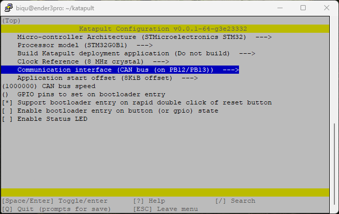

# CAN Bus Setup on CB1
## Katapult and Klipper Configuration
### Katapult
Clone the Katapult repository from [Arksine’s repository](https://github.com/Arksine/katapult "Arksine's Katapult Repository").
```
git clone https://github.com/Arksine/katapult
```


After cloning Katapult, open its directory and Katapult’s config file.
```
cd katapult
make menuconfig
```


\
Use the following config.\


Set the file and close it by typing Q and Y.

\
Build Katapult.
```
make clean
make
```


### Klipper
Go back, enter the Klipper directory, and open Klipper’s config file.
```
cd ..
cd klipper
make menuconfig
```


\
Use the following config.\


\
The CAN Bus configuration is vital to this file. You need to select the interface configuration written in the **printer.cfg** file.\
In my case, it is PB12/PB13. It may be different on your device, so check your **printer.cfg** file on Mainsail to get the correct configurations.\


Close the file by typing Q and Y.

\
Build Klipper.
```
make clean
make
```


:arrow_forward: Now, you can flash the Katapult and Klipper using DFU mode.

---

## Flashing Katapult and Klipper with DFU Mode
### DFU Mode

To flash Katapult and Klipper, the board needs to be in DFU (Device Firmware Update) mode.

Two buttons on the E3EZ that enter the board into DFU mode are:
- Boot
- Reset


\
You can always check whether the board is in DFU mode by typing `lsusb`.\
Type `lsusb` without doing anything with the **Boot** and **Reset** buttons.
You will see the following lines.\


\
Now, perform the following steps on your board:
- Push both the Boot and Reset buttons at the same time.
- First, release the Reset button, and then release the Boot button.


To check if the board is in DFU mode, type `lsusb` again.
This time, you need to see the following lines.\


### Flashing Katapult
When you have validated that E3EZ is in DFU mode, flash Katapult using the following line.
```
sudo dfu-util -a 0 -D ~/katapult/out/katapult.bin --dfuse-address 0x08000000:force:leave -d 0483:df11
```


It will flash Katapult, and you will see the following lines. You can ignore the dfu-util error at the end.\


Press the Reset button to restart the E3EZ.

Type again `lsusb` to ensure that the board is not in DFU mode.

### Flashing Klipper
Enter the DFU mode again by performing the following steps on your board:
- Push both the Boot and Reset buttons at the same time.
- First, release the Reset button, and then release the Boot button.

To check if the board is in DFU mode, type `lsusb` again.
You need to see the following lines again.


When you have validated that E3EZ is in DFU mode, flash Klipper using the following line.
```
sudo dfu-util -a 0 -d 0483:df11 --dfuse-address 0x08002000 -D ~/klipper/out/klipper.bin
```


It will flash Klipper, and you will see the following lines.\


Press the Reset button to restart the E3EZ.
Type again `lsusb` to ensure that the board is **not in DFU mode**.

:arrow_forward: You have flashed Katapult and Klipper on E3EZ and are ready to enable the CAN Bus.

---

## Enable the CAN Bus
### Nano
To enable CAN Bus, you need to create the interface file using Nano.

If Nano is not installed on the device, use the following command to get Nano.
```
sudo apt-get install nano
```

\
Create the interface file using Nano.
```
sudo nano /etc/network/interfaces.d/can0
```


\
It will open the Nano text editor.
Copy the following lines into the text editor, and be careful about the indentations at the last two lines.
```
allow-hotplug can0
iface can0 can static
 bitrate 1000000
 up ifconfig $IFACE txqueuelen 1024
```


Write the document using Ctrl+O and press Enter.\
Exit the document using Ctrl+X.

### Get UUID
Bring the CAN Bus interface **can0** up.
```
sudo ifup can0
```


Type `ifconfig` to check if the CAN Bus is running.


If everything works, you will get **the UUID** using the following command.
```
python3 ~/katapult/scripts/flash_can.py -q
```


:arrow_forward: You will use that UUID in the **printer.cfg** for **canbus_uuid** reference in the next [part](https://github.com/CanBayraktarkatal/MantaE3EZ-with-CB1-and-HermitCrab2-CANBus-setup-for-Ender3Pro/blob/main/Connect%20Hermit%20Crab%20V2.0%20to%20E3EZ.md "Connect Hermit Crab V2.0 to E3EZ"), and flash Katapult and Klipper on Hermit Crab V2.0.
