# Connect Hermit Crab V2.0 to E3EZ
## Set CAN Bus UUID on E3EZ
Open **printer.cfg** file in Mainsail.

Write your UUID under **mcu**. In my case, the UUID is e654b29d6b66.
```
canbus_uuid: e654b29d6b66
```


After you restart and reconnect to Mainsail, you will see **mcu** under the System Loads.\
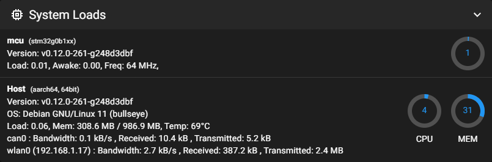

Now, you can flash Katapult and Klipper on Hermit Crab V2.0.

## Flash Katapult and Klipper on Hermit Crab V2.0
Connect Hermit Crab V2.0 to E3EZ via USB.\


### Build Katapult
To build Katapult for Hermit Crab V2.0, first connect the board via PuTTY.\
You can find all the following configs in the [Hermit Crab V2.0 document](https://github.com/bigtreetech/HermitCrab/blob/master/HermitCrab2/Hermit%20Crab%202%20CAN%20User%20Manual.pdf).

Go to the Katapult directory to complete its menu configuration.
```
cd katapult
make menuconfig
```

Use the following config.\
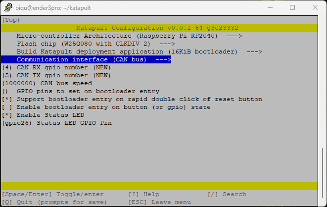

Check the file and close it by typing Q and Y.

Build Katapult.
```
make clean
make
```
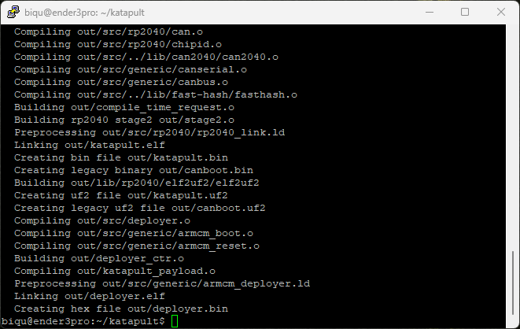

### Build Klipper
Return from the Katapult directory and go to the Klipper directory to complete its menu configuration.
```
cd ..
cd klipper
make menuconfig
```

Use the following config.\
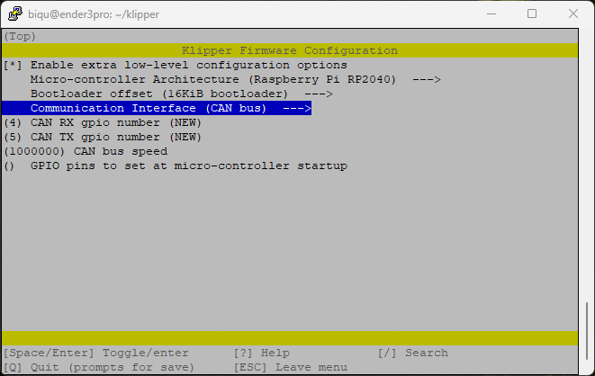

Check the file and close it by typing Q and Y.

Build Klipper.
```
make clean
make
```
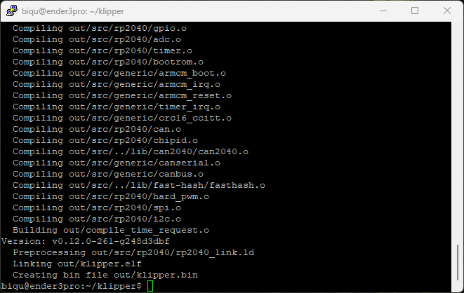

### Flash Katapult on Hermit Crab V2.0
Hermit Crab V2.0 has its **Boot** button on the same side as the USB-C port.\
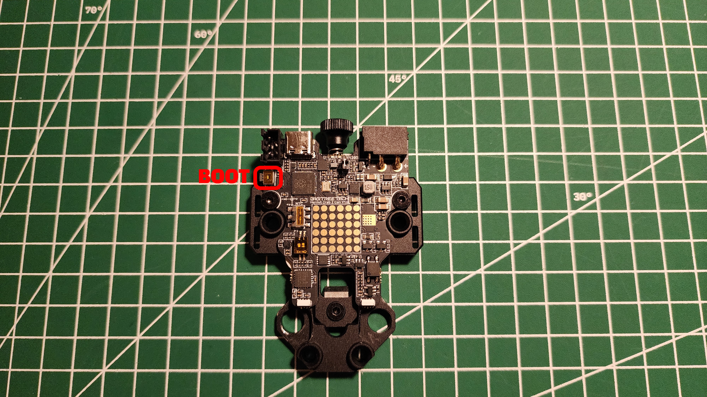

Hold the **Boot** button of the Hermit Crab V2.0 and connect it to E3EZ using a USB-C cable.\


Type again `lsusb` to ensure that the CB1 is not in DFU mode.

Get the **Raspberry Pi RP2** Boot ID. In my case, it is 2e8a:0003.\
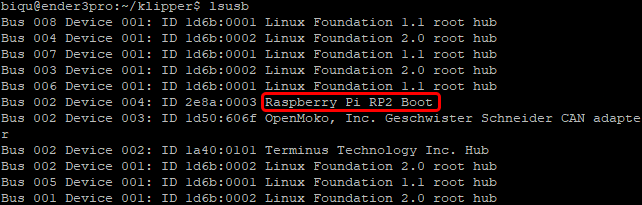

Go to the Katapult directory.
```
cd ..
cd katapult
```

Flash Katapult on it using the Raspberry Pi RP2 Boot bus ID.
```
make flash FLASH_DEVICE=2e8a:0003
```
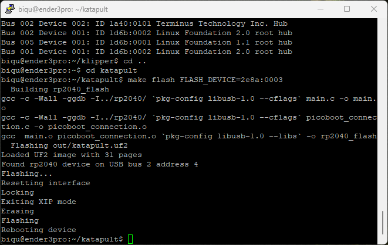

Now, you can connect the Hermit Crab V2.0 to E3EZ using the CAN Bus and power them together.

### Connect the CAN Bus
Unplug **everything**.

Connect CAN cable to Hermit Crab V2.0.\
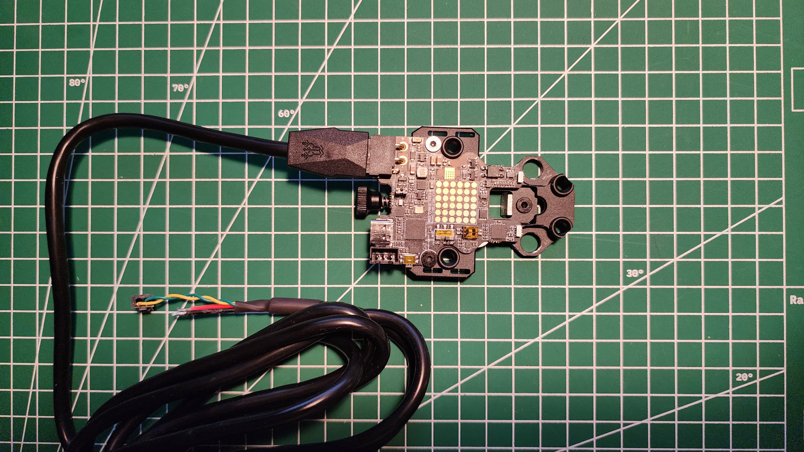

Connect the other end of the CAN cable to the E3EZ’s CAN slot located on the board.


Power E3EZ using a micro USB power cable and wait.\
Power Hermit Crab V2.0 using a USB-C cable.\
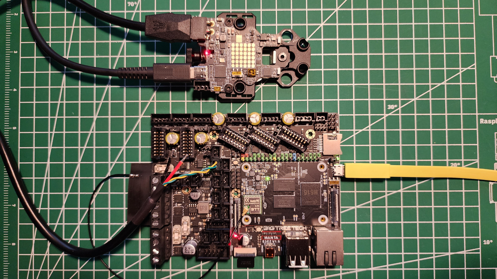

Open PuTTY and connect to the board.

List the devices connected to the CAN Bus.
```
python3 ~/katapult/scripts/flash_can.py -q
```
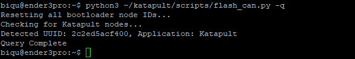

Right now, you can only see the Hermit Crab V2.0’s UUID.\
In my case, it is 2c2ed5acf400.

Connect Mainsail and go to Devices in **printer.cfg** file.\
Under the Katapult title in the CAN0 tab, you should see the same UUID. If not, click the “Refresh” button.\
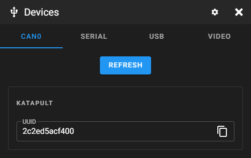

In **printer.cfg**, comment **canbus_uuid** to see Klipper and Katapult under Devices.\


Click “Save & Restart”.

Go to Devices and click “Refresh” to see Klipper and Katapult's UUID.\
The Klipper UUID is for the E3EZ, and the Katapult UUID is for the Hermit Crab V2.0.\
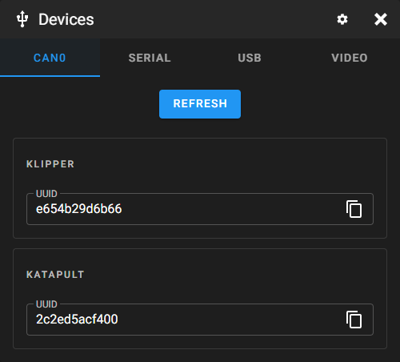

Now, E3EZ is connected to Hermit Crab V2.0 via Katapult.

### Flash Katapult and Klipper
Copy the Katapult UUID. In my case, it is 2c2ed5acf400.

Open PuTTY and connect to the board.

Go to the Katapult’s scripts directory.
```
cd katapult/scripts
```

Run the following command.
```
python3 flash_can.py -i can0 -f ~/klipper/out/klipper.bin -u 2c2ed5acf400
```
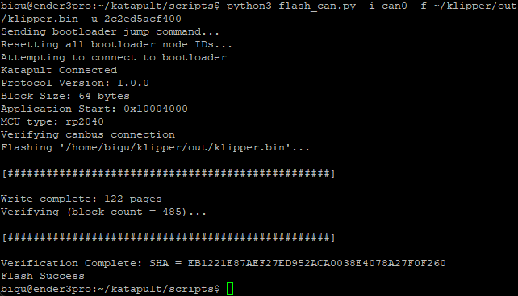

You flashed the Hermit Crab V2.0 and the E3EZ with the Klipper.

Now, you can write canbus_uuid under **mcu** in the **printer.cfg** in Mainsail.\
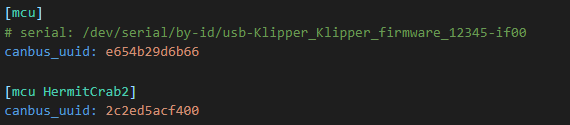

Click “Save & Restart”.

After you restart and reconnect to Mainsail, you will see the **mcu** details under System Loads.\
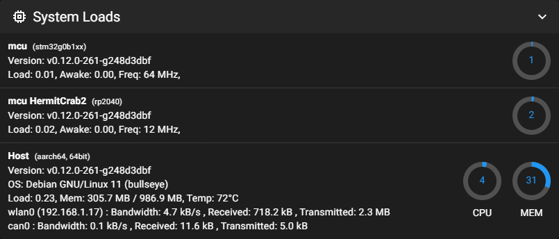

Now, you are ready to make the hardware connection on Ender 3 Pro.
